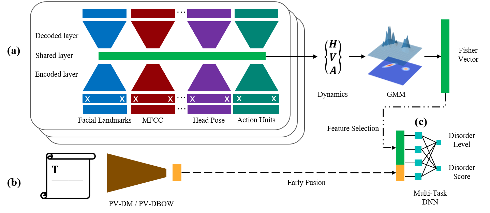

# Automatic Recognition of Bipolar Disorder from Multi-modal Data

Bipolar Disorder (BD), a common but serious mental health issue, adversely affects the well-being of individuals, but there exist difficulties in the medical treatment, such as insufficient recognition and delay in the diagnosis. Automatic recognition of bipolar disorder, based on a multi-modal machine learning approach, could help early detection of bipolar disorder and provide an insight into the personalized treatment of bipolar patients. Therefore, this project aims to find the biological descriptors of treatment response and produce an automatic recognition system in bipolar disorder.


## Generalized multi-modal framework on mental disorder recognition

After building the multimodal framework for the BD classification, we consider it as a generalized framework for mental disorder recognition, not limited on BD. We then extend our work on E-DAIC dataset for depression detection task and the experimental results show effective feature learning and a promising application on other mental-related tasks. Our work was accepted the [15th IEEE International Conference on Automatic Face and Gesture Recognition](https://fg2020.org/) with the title **Multimodal Deep Learning Framework for Mental Disorder Recognition**.

The proposed multi-modal framework is displayed as follows



where more information could refer to the dissertation in the folder ```paperwork```


## How to use

Before running the experiment, please 
```
pip install -r requirements.txt
conda install --file requirements.txt
```
for building dependencies though ```conda``` is more recommended
```
python main -h
python main --help
```
for project help
```
python main -b
python main --baseline
```
for baseline system in BD recognition
```
python main -x
python main --experiment
```
for proposed system in BD recognition
```
python main -v
python main --visualize
```
for visualization


## Note

The provided dataset is for the Bipolar Disorder Sub-Challenge (BDS) of the 8th Audio/Visual Emotion Challenge and Workshop (AVEC 2018): "Bipolar Disorder and Cross-cultural Affect". __Under no circumstances__ is anyone allowed to share any part of this dataset with others, even close ones. 

## Others

More explainable documents could be found in this repository, such as 
* review of AVEC2018 [[link](docs/AVEC2018.md)]
* review of AVEC2019 [[link](docs/AVEC2019.md)]
* information of BD dataset [[link](docs/dataset.md)]
* literature of multimodal learning [[link](docs/literature.md)]
* structure of this repo [[link](docs/structure.md)]