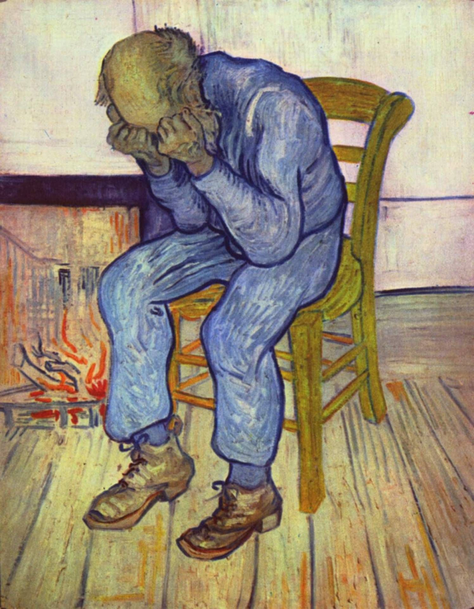

# ABOUT THE DATASET

## basics about the dataset

[The Turkish Audio-Visual Bipolar Disorder Corpus](https://www.cmpe.boun.edu.tr/~salah/ciftci18aciiasia.pdf) is a new dataset for the affective computing and psychiatric communities. The corpus is annotated for BD state, as well as Young Mania Rating Scale (YMRS) by psychiatrists. The investigated features include __functionals of appearance descriptors__ extracted from fine-tuned Deep Convolutional Neural Networks (DCNN), __geometric features__ obtained using tracked facial landmarks, as well as __acoustic features__ extracted via openSMILE tool. Furthermore, acoustics based emotion models are trained on a Turkish emotional dataset and emotion predictions are cast on the utterances of the BD corpus. The affective scores/predictions are investigated with linear regression and correlation analysis against YMRS declines to give insights about BD, which is directly linked with emotional lability, i.e. quick changes in affect.

The core aim of the efforts on the corpus is to find **biological markers/predictors** of treatment response via signal processing and machine learning techniques to reduce treatment resistance.

## recordings in the dataset


| diagnosis     | # videos | average time (s)   | standard deviation |
| --            | --       | --                 | --                 |
| healthy       | 120      | 138.9              | 68.4               |
| remission     | 62       | 151.9              | 65.4               |
| hypomania     | 82       | 221.1              | 171.4              |
| mania         | 88       | 276.4              | 246.3              |


## details about the dataset

The BD corpus used for the AVEC 2018 BDS includes *audiovisual recordings* of structured interviews performed by **46** Turkish speaking subjects (**49** healthy controls). Participants of the BD corpus were asked to complete seven tasks, e.g. explaining the reason to participate the activity, describing happy and sad memories, counting up to thirty, and explaining two emotion eliciting pictures (as below). 

| van Gogh's *Depression* | Dengel's *Home Sweet Home* |
| :---------------------: | :------------------------: |
|  |  |

During hospitalisation, in every follow up day (0th, 3rd, 7th, 14th, 28th day) and after discharge on the 3rd month, the presence of depressive and manic features were evaluated using YMRS. The dataset can be summarized with following data:

* audio (.wav), video recording (.mp4) of each subject
* labels (level of mania and YMRS) and metadata (age, gender)
* baseline features

More specifically, the tree structure of the BD corpus:

```tree
├── recordings
│   ├── recordings_audio (#218)
|   |   ├── train_001 ... train_104
|   |   ├── dev_001 ... dev_060
|   |   ├── test_001 ... test_054
|   |   ├── (.wav)
|   ├── recordings_video (#218)
|   |   ├── train_001 ... train_104
|   |   ├── dev_001 ... dev_060
|   |   ├── test_001 ... test_054
|   |   ├── (.mp4)
├── LLDs_audio_SMILE
|   ├── LLDs_audio_eGeMAPS (#218)
|   |   ├── train_001 ... train_104
|   |   ├── dev_001 ... dev_060
|   |   ├── test_001 ... test_054
|   |   ├── (.csv)
|   ├── LLDs_audio_MFCCs (#218)
|   |   ├── train_001 ... train_104
|   |   ├── dev_001 ... dev_060
|   |   ├── test_001 ... test_054
|   |   ├── (.csv)
├── LLDs_video_openFace
|   ├── LLDs_video_openFace (#436)
|   |   ├── train_001 ... train_104
|   |   ├── dev_001 ... dev_060
|   |   ├── test_001 ... test_054
|   |   ├── (.csv + .hog)
├── sound_separator
|   ├── sound_separator (#218)
|   |   ├── train_001 ... train_104
|   |   ├── dev_001 ... dev_060
|   |   ├── test_001 ... test_054
|   |   ├── (.csv)
├── VAD_turns
|   ├── VAD_turns (#218)
|   |   ├── train_001 ... train_104
|   |   ├── dev_001 ... dev_060
|   |   ├── test_001 ... test_054
|   |   ├── (.csv)
├── baseline_features
|   ├── features_audio_BoAW_A20_C1000 (#218)
|   |   ├── 2_train_001 ... 2_train_104
|   |   ├── 2_dev_001 ... 2_dev_060
|   |   ├── 2_test_001 ... 2_test_054
|   |   ├── (.csv)
|   ├── features_audio_eGeMAPS_turns (#218)
|   |   ├── train_001 ... train_104
|   |   ├── dev_001 ... dev_060
|   |   ├── test_001 ... test_054
|   |   ├── (.arff)
|   ├── features_video_BoVW_A20_C1000 (#218)
|   |   ├── 11_train_001 ... 11_train_104
|   |   ├── 11_dev_001 ... 11_dev_060
|   |   ├── 11_test_001 ... 11_test_054
|   |   ├── (.csv)
|   ├── LLDs_audio_DeepSpectrum_turns (#218)
|   |   ├── train_001 ... train_104
|   |   ├── dev_001 ... dev_060
|   |   ├── test_001 ... test_054
|   |   ├── (.csv)
|   ├── LLDs_audio_opensmile_MFCCs_turns (#218)
|   |   ├── train_001 ... train_104
|   |   ├── dev_001 ... dev_060
|   |   ├── test_001 ... test_054
|   |   ├── (.csv)
|   ├── LLDs_video_openFace_AUs (#218)
|   |   ├── train_001 ... train_104
|   |   ├── dev_001 ... dev_060
|   |   ├── test_001 ... test_054
|   |   ├── (.csv)
|   ├── baseline_features_proc
|   |   ├── MFCC_[featall,labels,instance]_[1,2].csv
|   ├── features_MATLAB 
|   |   ├── AU_[featall,labels,instance]_[1,2].csv
|   |   ├── BoW_[featall,labels,instace]_[1,2].csv
|   |   ├── Deep_[featall,labels,instance]_[1,2].csv
|   |   ├── eGeMAPS_[featall,labels,instance]_[1,2].csv
|   |   ├── MFCC_[featall,labels,instance]_[1,2].csv
├── labels_metadata.csv
├── BD_corpus_intro.pdf
├── readme.txt
```

## labels_metadata (only train & dev)
In this csv file, each instance has been labelled with SubjectID, Age, Gender, Total_YMRS, and ManiaLevel. Note that each subjects produces 3, 4, 5, or 6 instances and **labels for test data are not given**.

According to the AVEC 2018 summary, after downloading the data, participants could directly start their own experiments with the train and development sets. Participants' results needed to be sent as a single packed file per Sub-challenge to the organisers by email and scores were returned within 24 hours during typical working days. Each participant had up to **five** submission attempts per Sub-challenge. 

Instead of being collected statistic information from the label metadata (let alone it is quite inadequate), the demographic and clinical characteristics are gathered from the original dataset paper and listed as below:

|       | female        | male          | all           | healthy control   | $t/x^2$   | $p$  |
| :--   | :--:          | :--:          | :--:          | :--:              | :--:      | :--: |
| AGE   | 40.2 ± 8.8    | 35.02 ± 10.6  | 36.7 ± 10.3   | 37.3 ± 10.9       | 0.36      | 0.72 |
| ED    | 12.6 ± 2.9    | 9.5 ± 3.3     | 10.5 ± 3.5    | 11.2 ± 3.7        | 0.89      | 0.11 |
| TE    | 7.13 ± 7.7    | 7.67 ± 5.7    | 6.26 ± 6.4    | -                 | 0.71      | 0.48 |
| TID   | 15.9 ± 9.9    | 12.02 ± 9.7   | 13.07 ± 9.8   | -                 | 1.41      | 0.16 |

> ED: education in years, TE: total episode, TID: total illness duration

## audio LLDs and features

> note that the feature for each sample is of variable length as each video clip has different lengths.

### MFCC

In speech processing, the __mel-frequency cepstrum (MFC)__ is a representation of the short-term power spectrum of a sound based on a linear cosine transform of a log power spectrum on a nonlinear mel scale of frequency. __Mel-frequency cepstral coefficients (MFCC)__ are coefficients that collectively make up an MFC. They are derived from a type of cepstral representation of the audio clip. 

MFCCs are commonly derived as follows:
1. Take the Fourier transform of (a windowed excerpt of) a signal.
2. Map the powers of the spectrum obtained above onto the mel scale, using triangular overlapping windows.
3. Take the logs of the powers at each of the mel frequencies.
4. Take the discrete cosine transform of the list of mel log powers, as if it were a signal.
5. The MFCCs are the amplitudes of the resulting spectrum.

Extracted *MFCCs* features have 40 dimensions:
* frameTime > **COULD BE PARAGRAPH VECTOR**
* pcm_fftMag_mfcc[0:12]
* pcm_fftMag_mfcc_de[0:12]
* pcm_fftMag_mfcc_de_de[0:12]

> MFCCs from 25ms audio frames (sampled at a rate of 10ms). It computes 13 MFCC from 26 Mel-Frequency bands, and applies a cepstral liftering filter with a weight parameter of 22. 13 delta and 13 acceleration coefficients are appended to the MFCC.

### eGeMAPS

GeMAPS stands for the Geneva Minimalistic Acoustic Parameter Set and it is a basic standard acoustic parameter set for various areas of automatic voice analysis. These parameters are selected based on a) the potential to index effective physiological changes in voice production, b) the proven value in former studies as well as the automatic extractability, and c) the theoretical significance.

Extracted *eGeMAPS* features have 24 dimensions:
* frameTime
* **Loudness**_sma3 ------ estimate of perceived signal intensity from an auditory spectrum
* **alphaRatio**_sma3 ------ ratio of the summed energy from 50-1000Hz and 1-5kHz
* **hammarbergIndex**_sma3 ------ ratio of the strongest energy peak in the 0-2kHz region to the strongest peak in the 2-5kHz region
* **slope0-500**_sma3 ------ linear regression slope of the logarithmic power spectrum within band
* **slope500-1500**_sma3 ------ linear regression slope of the logarithmic power spectrum within band
* **spectralFlux**_sma3
* **mfcc[1:4]**_sma3
* **F0semitoneFrom27.5Hz**_sma3nz
* **jitterLocal**_sma3nz ------ deviations in individual consecutive $F_0$ period lengths
* **shimmerLocaldB**_sma3nz ------ difference of the peak amplitudes of consecutive $F_0$ periods 
* **HNRdBACF**_sma3nz ------ Harmonics-to-Noise Ratio, relation of energy in harmonic components to energy in noise-like components
* **logRelF0-H1-[H1;A3]**_sma3nz
* **F1[frequency;bandwidth;amplitudeLogF0]**_sma3nz 
* **F2[frequency;amplitudeLogRelF0]**_sma3nz
* **F3[frequency;amplitudeLogRelF0]**_sma3nz

### Deep Spectrum

As unsupervised audio baseline feature representations, __Deep Spectrum__ features are extracted using deep representation learning paradigm heavily inspired by image processing. __Deep Spectrum__ features have been shown to be effective in tasks highly related to emotion recognition, sentiment classification, and autism severity recognition. 

[Deep Spectrum](https://github.com/DeepSpectrum/DeepSpectrum) is a Python toolkit for feature extraction from audio data with pre-trained Image Convolutional Neural Networks (CNNs). It features an extraction pipeline which first creates visual representations for audio data - plots of spectrograms or chromagrams - and then feeds them into a pre-trained Image CNN. Activations of a specific layer then form the final feature vectors. In this project, 4096-dimensional feature vectors are extracted from the mel-spectrogram images using the activations from the second fully-connected layer (*fc7*) of *ALEXNET*.

Extracted *Deep Spectrum* features have 4096 dimensions:
* frameTime
* **neuron**_[1:4095] ------ activations from the second fully-connected layer in *ALEXNET*

### BoAW 

Bags-of-Words (BoW) represents the distribution of LLDs according to a dictionary learned from them. To generate the XBoW-representations, both the acoustic and the visual features are processed and summarised over a block of a fixed length duration, for each step of 100ms or 400ms. 

Bags-of-Audio-Words (BoAW) are generated with a window size of 2s (best duration obtained by a grid search) and a hop-size of 1s, and 20 soft assignments are performed on a codebook size of 1000 instances. The whole XBoW processing is executed using [openXBOW](https://github.com/openXBOW/openXBOW).

Extracted *BoAW* features have 1000 dimensions

## video LLDs and features

### AU (openFace) 

**OpenFace** is an implementation of a number of research papers from the Multicomp group, Language Technologies Institute at the Carnegie Mellon University and Rainbow Group, Computer Laboratory, University of Cambridge. The system is capable of performing a number of facial analysis tasks:
* facial landmark detection
* facial landmark and head pose tracking
* facial action unit recognition
* facial feature extraction (aligned faces & HOG feature)
* gaze tracking

Extracted *openFace* features have 469 dimensions:
* frame
* face_id
* timestamp
* confidence
* success
* gaze_[0,1]_[x,y,z]
* gaze_angle_[x,y]
* eye_lmk_[x,y,X,Y,Z]_[0:55]
* pose_[Tx,Ty,Tz]
* pose_[Rx,Ry,Rz]
* [x,y]_[0:67] 
* AU[01,02,04,05,06,07,09,10,12,14,15,17,20,23,25,26,45]_r
* AU[01,02,04,05,06,07,09,10,12,14,15,17,20,23,25,26,28,45]_c

### BoVW

Bags-of-Words (BoW) represents the distribution of LLDs according to a dictionary learned from them. To generate the XBoW-representations, both the acoustic and the visual features are processed and summarised over a block of a fixed length duration, for each step of 100ms or 400ms. 

Bags-of-Video-Words are generated with a window size of 11s (best duration found in a grid search) and a hop-size of 1s, and the same parameters for soft assignments and codebook size as defined for the audio data are used. The whole XBoW processing is executed using [openXBOW](https://github.com/openXBOW/openXBOW).

Extracted *BoVW* features have 1000 dimensions

## text modality

The data in text modality (turkish) is transcribed using [Speech-to-Text Client Library](https://cloud.google.com/speech-to-text/docs/reference/libraries#client-libraries-install-python) and its embeddings are inferred through a ```doc2vec``` model, which is pre-trained on a Turkish corpus, "[trwiki](https://dumps.wikimedia.org/trwiki/20190501/)". The **trwiki** is based on Wikimedia dump service and it contains articles, templates, media/file descriptions, and primary meta-pages. 