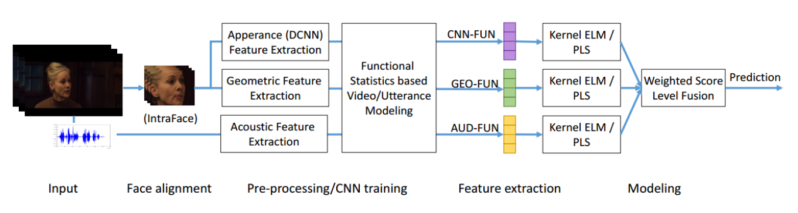
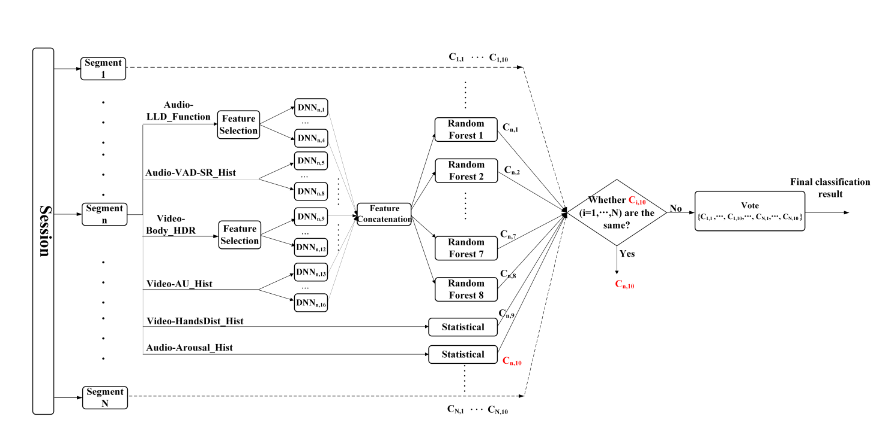
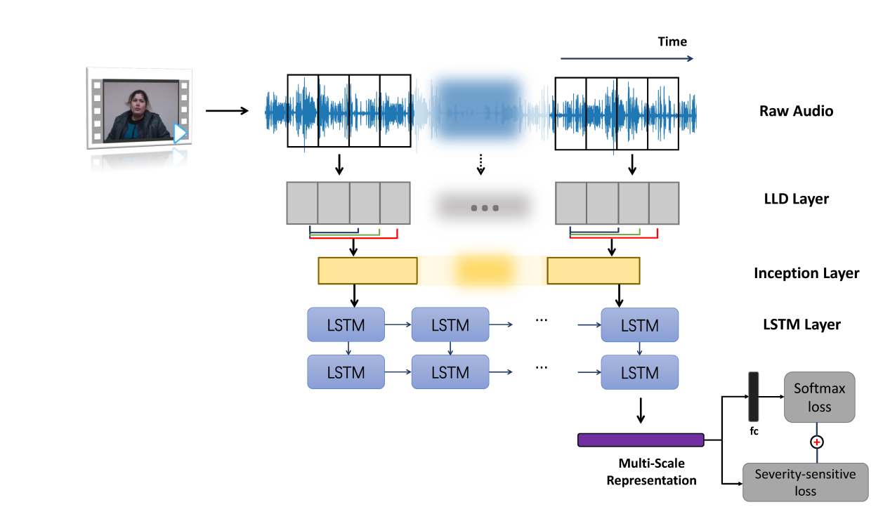
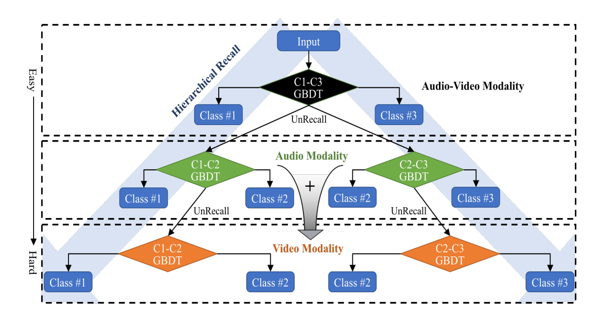
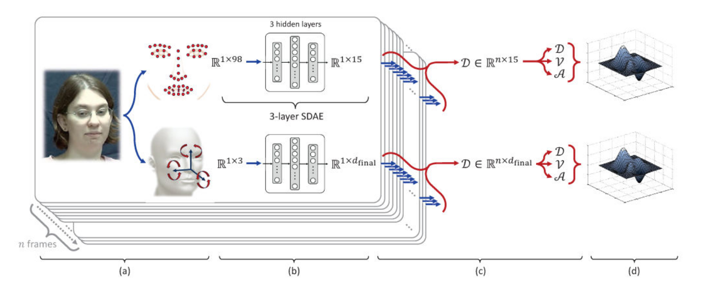

# Literature Review

This document records the literature of the project, and it focuses on other papers' contributions and methodological inspiration whose results or conclusion will also be included.

**Table of Contents**
- [Literature Review](#literature-review)
    - [The Turkish Audio-Visual Bipolar Disorder Corpus](#the-turkish-audio-visual-bipolar-disorder-corpus)
      - [Ciftci2018](#ciftci2018)
    - [Bipolar Disorder Recognition with Histogram Features of Arousal and Body Gestures](#bipolar-disorder-recognition-with-histogram-features-of-arousal-and-body-gestures)
      - [Yang2018](#yang2018)
    - [Bipolar Disorder Recognition via Multi-scale Discriminative Audio Temporal Representation](#bipolar-disorder-recognition-via-multi-scale-discriminative-audio-temporal-representation)
      - [Du2018](#du2018)
    - [Multi-modality Hierarchical Recall based on GBDTs for Bipolar Disorder Classification](#multi-modality-hierarchical-recall-based-on-gbdts-for-bipolar-disorder-classification)
      - [Xing2018](#xing2018)
    - [Automated Screening for Bipolar Disorder from Audio/Visual Modalities](#automated-screening-for-bipolar-disorder-from-audiovisual-modalities)
      - [Syed2018](#syed2018)
    - [The Geneva Minimalistic Acoustic Parameter Set (GeMAPS) for Voice Research and Affective Computing](#the-geneva-minimalistic-acoustic-parameter-set-gemaps-for-voice-research-and-affective-computing)
      - [Eyben2015](#eyben2015)
    - [Dynamic Multimodal Measurement of Depression Severity Using Deep Autoencoding](#dynamic-multimodal-measurement-of-depression-severity-using-deep-autoencoding)
      - [Dibeklioglu2018](#dibeklioglu2018)
    - [Automatic Depression Scale Prediction using Facial Expression Dynamics and Regression](#automatic-depression-scale-prediction-using-facial-expression-dynamics-and-regression)
      - [Jan2014](#jan2014)
    - [Personalized Multitask Learning for Predicting Tomorrow's Mood, Stress, and Health](#personalized-multitask-learning-for-predicting-tomorrows-mood-stress-and-health)
      - [Taylor2017](#taylor2017)
    - [Multimodal emotion recognition using deep learning architectures](#multimodal-emotion-recognition-using-deep-learning-architectures)
      - [Ranganathan2016](#ranganathan2016)
    - [paper title](#paper-title)
      - [bibtex](#bibtex)

### The Turkish Audio-Visual Bipolar Disorder Corpus
#### Ciftci2018

This paper introduces a new audio-visual Bipolar Disorder (BD) corpus for the affective computing and psychiatric communities. 

To provide a benchmark system and insight about the data, they investigated a direct approach to classify video sessions into BD and normal classes, using **audio-visual features**. 

They experimented both modalities (audio & video) for **binary** (healthy/bipolar) and **ternary** (mania level) classifications. They also analysed the bipolar corpus using cross-corpus acoustic emotion recognition, to reveal statistically significant mid-level predictors of YMRS declines from the zeroth day recording.

### Bipolar Disorder Recognition with Histogram Features of Arousal and Body Gestures 
#### Yang2018

The **contributions** of their work are as follows:
* A histogram based arousal feature, in which the continuous arousal values are estimated from the audio cues by a Long Short-Term Memory Recurrent Neural Network (LSTM-RNN) model (trained on AVEC 2015 affective database). Then the histogram of the arousal values in each segments are used for the classification;
*  A Histogram of Displacement (HDR) based upper body posture feature, which characterizes the displacement and velocity of the key body points in the video segment;
*  A DNN and Random Forest based multi-stream fusion framework, and several DNN models with an ensemble learning strategy in order to mitigate the overfitting because of the limited training data.

Some effective features were proposed for the classification.

* The audio features include 
  * 120 histogram based arousal features (**Audio-Arousal_Hist**);
  * 6902 dimensional feature vector for each audio sample (**Audio-LLD_Function**);
  * 20 dimensional feature vector about speech pause and speaking rate (**Audio-VAD-SR_Hist**). 

> Among ratings-based features (arousal/valence/dominance), experimental results showed that arousal demonstrated better depression classification results than valence and dominance.

* The video features include
  * 50 histogram based hands distance features (**Video-HandsDist_Hist**); 
  * 400 HDR (Histogram of Displacement) features for each segment (**Video-Body_HDR**);
  * 18 dimensional feature vector about action units (**Video-AU_Hist**).

In the data processing, the number of video segments were increased with a sliding window, feature dimensions were decreased with CFS + SFFS + SVM based feature selection + PCC, and features were normalized with z-score normalization.

In the classification, features **Audio-Arousal_Hist** and **Video-HandsDist_Hist** were distinguishable enough to be used for statistical method. While other features were fed into separate DNNs, and then after feature concatenation, random trees were applied to give classification results. In the multistream classification, the weight of **Audio-Arousal_Hist** was increased because of better performance.

> To their best knowledge, it was the first to utilize the affective dimension (arousal) in bipolar depression assessment.

### Bipolar Disorder Recognition via Multi-scale Discriminative Audio Temporal Representation
#### Du2018

The **contributions** of their work are as follows:
* **IncepLSTM**, the Inception module joint with an LSTM layer, to achieve multi-scale audio temporal representation for BD recognition;
  * Authors of Turkish Audio-Visual BD Corpus merely used statistics across the frame-based features
* An improved triplet loss function, called severity sensitive loss, to enhance the supervision of the learning procedure, making BD representation more discriminative;
  * The triplet loss optimizes the embedding space so that data points with the same identity are closer to each other than those with different identities.
* The sparse structure to compress the IncepLSTM network, reducing the risk of overfitting and improving the robustness

Bipolar symptoms are _episodic_, especially with irregular variations among different episodes, making BD very difficult to be diagosed accurately.

16-dimensional Mel-Frequency Spectrum Coefficients (MFCCs) were extracted as Low-Level Descriptors (LLDs). Three kinds of convolution filters with kernel sizes $d\times1$, $d\times3$, $d\times5$ were applied on the temporal feature sequence concurrently ($d$ was the dimension of LLD feature vector). Besides, the $5\times5$ kernel was divided into two $3\times3$ kernels, reducing the parameter number and avoiding overfitting. The LSTM layer takes multi-scale intermediate temporal representation from the Inception module as input to capture dynamic information so as to obtain final high-level description for the whole audio. IncepLSTM was then trained by the joint supervision of the softmax loss with the severity-sensitive loss.

To sum up, for each audio, 16-dimensional normalized feature vectors were formed from MFCCs as the LLD input for __IncepLSTM__.

### Multi-modality Hierarchical Recall based on GBDTs for Bipolar Disorder Classification
#### Xing2018

> possibly the best in AVEC 2018

The **contributions** of their work are as follows:
* A novel hierarchical recall model, where patients of different mania level were recalled at multi-layers instead of single layer;
* _Topic modelling_, where audio, video and text features were generated for each topic segment respectively:
  * detailed information of each topic was retained
  * each topic was characterized by different features

Authors mentioned that, to eliminate overfitting, feature selection was used further to discard redundant features or select more discriminative features. According to authors, there are two kinds of information integration strategies, namely subject-level and topic-level. Besides, there are two kinds of multi-modality fusion, namely feature-level fusion and decision-level.

One intuition of theirs was to perform different decision strategies for different patients instead of classifying all patients at same layer. They proposed a novel hierarchical recall framework, which was symmetric and took advantages of different modalities in each layer.

> the predictions of patients are made layer-by-layer, where patients with high confidence level were first recalled while those with low confidence level were delivered to next layer to perform further judgement.

1002 dimensional audio features were extracted that included $R^{248}$ global features ((23 eGeMAPS + 39 MFCCs) $\times$ 4 statistic functions), $R^{248\times3}$ topic-level features (3 topics in total) and $10$ timing of speech features. 3607 dimensional visual features were extracted, including AUs MHH features $R^{17\times5\times10\times3}$, AUs statistics $R^{(17\times16)\times3}$, eyesight feature $R^{17\times3}$, emotion feature $R^{(11+13\times2+24)\times3}$ and body movement feature $R^7$. 786 dimensional text features were extracted that included 14 linguistic features and 8 kinds of sentiment indices. In total, the dimension of feature in each interview was 5395. The following feature selection was completed by Analysis of Variance algorithm.

### Automated Screening for Bipolar Disorder from Audio/Visual Modalities
#### Syed2018

> Syed et al. have conducted research in this areas for a long time, and their paper in AVEC 2017 is still worthy reading.

The **contributions** of their work are as follows:
* The proposed 'turbulence features' to capture suddent, erratic changes in feature contours;
* Fisher vector encoding of Computational Paralinguistics Challenge (ComParE) low level descriptors that were demonstrated to be viable for predicting the severity of mania;
* Four feature sets from OpenSmile toolkit, namely Prosody, IS10-Paralinguistics, ComParE functionals and eGeMAPS features were most useful for automated screening of bipolar disorder;
* Greedy Ensembles of Weighted Extreme Learning Machines (GEWELMs) classifier for the task of predicting the severity of mania.

Given that labels are based on YMRS scores, they firstly identify key behavioural characteristics of individuals with mania as per the YMRS. This enabled them to use craft features which can probe for the existence of these characteristics, as opposed to brute-force methods which aim to learn the dataset without using background knowledge. 

The 'turbulence features' (for a wide range of audio/visual features) were the most important in the paper and authors computed the crest factor as the measure of turbulence, __the ratio between the absolute maximum value of the signal and its root mean square value__. 

> 'turbulence features': the measure of turbulence was computed from the crest factor, which measured the ratio between the absolute maximum value of the signal and its root mean square (RMS) value.

The process of Fisher vector encoding was summarised as follows: ComParE LLDs from each speech recording was concatenated into one matrix and then using a GMM to build a background model for the feature space. 

They proposed GEWELMs for classification (the efficacy had been demonstrated), which is based on WELMs and ELMs (Weighted Extreme Learning Machines). They used ELMs as a method to reduce dimensionality and least square regression towards class label prediction. To handle the overfitting of GEWELMs, they trained two sets of GEWELMs, T2D-GEWELMs and D2T-GEWELMs, which are training on the training set and testing on the development set, and training on the development set and testing on the training set. This helped to regularize the selection of WELMs so only those that had acceptable performance for two regimes were selected.

> GEWELMs are essentially a single layer feed-forward neural network where the hidden layer is assigned randomly generated weights which are not updated during the training process

### The Geneva Minimalistic Acoustic Parameter Set (GeMAPS) for Voice Research and Affective Computing
#### Eyben2015

In their research, they mentioned that emotional cues conveyed in the voice have been empirically documented the research have explored a large number of acoustic parameters, including parameters in:
* Time domain (speech rate)
* Frequency domain (fundamental frequency ($F_0$)
* Amplitude domain (intensity or energy)
* spectral distribution domain (relative energy in different frequency bands)

Moreover, large brute-force feature sets reduce the generalisation capabilities to unseen (test) data. Minimalistic parameter sets might reduce this danger and lead to better generalisation in cross-corpus experiments and ultimately in real-world test scenarios.

### Dynamic Multimodal Measurement of Depression Severity Using Deep Autoencoding
#### Dibeklioglu2018

The **contributions** of their work are as follows:
* They focused on an interpersonal context, clinical interviews and they anticipated that the interpersonal nature of clinical interviews would heighten discriminability across modalities. 
* They investigated the discriminative power of three modalities, **facial movement dynamics**, **head movement dynamics**, and **vocal prosody**, individually and in combination to measure depression severity.
* Instead of using a large number of descriptors or selecting informative features individually, they investigated the selection of **an optimum feature set** by maximizing the combined mutual information for depression severity measurement.

Since depression _alters_ the timing of nonverbal behaviour, they focused on the dynamics of facial and head movement, as well as vocal fundamental frequency and switching pauses.

In the visual features extraction, they proposed their pipeline:
1. Automatic Tracking of Facial Landmarks and Head Pose 
   1. Track and extract 49 facial landmarks and 3 degrees of out-of-plane rigid head movements (pitch, yaw, roll)
2. Preprocessing of the Extracted Facial Landmarks and Head Pose
   1. Normalize and smooth the landmark coordinates and 3 degress
3. Per-Frame Encoding of Facial and Head Movement (SDAE)
   1. Three challenges:
      1. The movements of individual fiducial points and head pose orientations are highly correlated.
      2. Both facial and head movement measures include redundant information and complex relations that cannot re revealed by linear methods.
      3. Only a single label is available for each session.
   2. Training should be layer-wise and fune-tuning on minimizing the prediction error
   3. SDAE-based time series *D* (n\*d) are the learnt representation. Each column of *D* correspond to a specific movement and they computed the dynamics *V* (1st derivate of *D*) and *A* (2nd derivate of *D*).
      1. For the purpose of alignment of the three time series (*D*, *V*, *A*), the first two frames of videos were discarded.
4. Per-Video Encoding of Facial and Head Movement
   1. It was useful to encode the extracted time series descriptors with fixed length per-video descriptors. 
   2. Improved Fisher Vector (IFV)
   3. Compact Dynamic Feature Set (DFS)

**Stacked Denoising Autoencoders (SDAE)** has emerged as one of the most successful unsupervised methods to discover unknown non-linear mappings between features (face and head movement dynamics) and outcomes (depress severity scores) while coping with high dimensionality and redundancy.

### Automatic Depression Scale Prediction using Facial Expression Dynamics and Regression
#### Jan2014

The **contributions** of their work are as follows:
* the dynamic feature extraction that use the idea of MHH on the feature space (they proposed 1-D MHH that can be applied to feature vector sequences and provide a dynamic feature, e.g. **EOH_MHH**, **LBP_MHH**, **LPQ_MHH**)
* the feature fusion from different features from images (the fusion on **decision** level solution achieved better results on the development set, and the same result for the testing set)

People express their emotions through the visual (i.e. facial expression and bodily gestures), vocal, and physiological modalities, and among these modalities, **facial expression** plays a primary role in representing emotional states of human beings.

### Personalized Multitask Learning for Predicting Tomorrow's Mood, Stress, and Health
#### Taylor2017

They posited that the low performance of machine learning methods in predicting mood or wellbeing was because a one-size-fits-all machine learning model is inherently ill-suited to predicting outcomes like mood and stress, which vary greatly due to individual difference. Therefore, they employed Multitask Learning (MTL) techniques to train personalized ML models which were customized to the needs of each individual, but still leveraged data from across the population.

### Multimodal emotion recognition using deep learning architectures
#### Ranganathan2016

In their work, as the first contribution, they presented the *emoFBVP* database of multimodal recordings-facial expression, body gestures, vocal expressions and physiological signals. The second contribution was to investigate the use of deep learning architectures - DBNs and CDBNs - for multimodal emotion recognition. 

In summary, the features they extracted included vocal expressions with **180** dimension, facial expressions with **540** dimension, body gestures with **540** dimension, and physiological signal data with **120** dimension.

The proposed four *DemoDBN* models are:
1. *DemoFBVP*: basic two-layer DBN model
2. *f*+*DemoFBVP*: two-layer DBN with feature selection prior to training
3. *DemoFBVP*+*f*: two-layer DBN with feature selection post training
4. *3DemoFBVP*: three-layer DBN model

### paper title
#### bibtex
