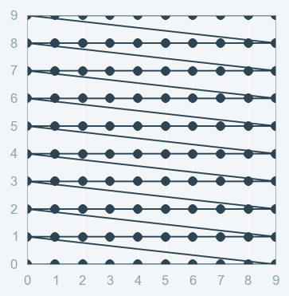
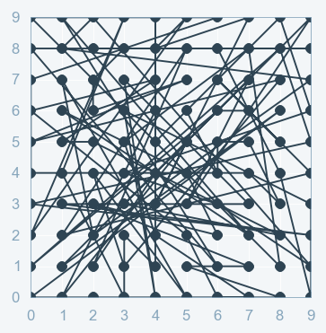

npy## GPU_VM

### upload: local -> remote
```
scp <local_file> user@remote_host:<remote_file>
```
e.g.
```
scp ~/Downloads/dataset.zip zz362@dev-gpu-0.cl.cam.ac.uk:~/workspace
```

### download: remote -> local
```
scp user@remote_host:<remote_file> <local_file>
```
e.g.
```
scp zz362@dev-gpu-0.cl.cam.ac.uk:~/workspace/bipolar-disorder/pre-trained/DDAE/xxx.zip ~/Downloads/
```

### upload/download a folder
```
scp -r <local_folder> user@remote_host:<remote_folder>
scp -r user@remote_host:<remote_folder> <local_folder>
```

```-r``` recursively copy entire directories

### unzip
```
unzip <filename>.zip -d <destination_folder>
```

## Hyperparameter tuning

Optimizing hyperparameters is considered to be the trickiest part of building machine learning models. It is nearly impossible to predict the optimal parameters while building a model, at least in the first few attempts. That is why we always go by playing with the hyperparameters to optimize them. However, this is not scalable for high dimensional data because the number of the increase in iterations, which in turn expands the training time.

Hyperparameter tuning refers to the shaping of the model architecture from the available space. Two of the most widely-used parameter optimizer techniques: **Grid Search** vs. **Random Search**.


### Grid Search

**Grid search** is a technique which tends to find the right set of hyperparameters for the particular model. In this tuning technique, we simply build a model for every combination of various hyperparameters and evaluate each model. The pattern is similar to the grid, where all the values are placed in the form of a matrix. Each set of hyperparameters is taken into account and the accuracy is noted. Once all the combinations are evaluated, the model with the set of hyperparameters which gives the top accuracy is considered the best. 



One of the drawbacks of grid search is that when it comes to dimensionality, it suffers when evaluating the number of hyperparameters grows exponentially. However, there is no guarantee that the search will produce the perfect solution, as it usually finds one by aliasing around the right set.

### Random Search

**Random search** is a technique where random combinations of the hyperparameters are used to find the best solution for the built model. It is similar to the grid search, and yet it has proven to yield better results comparatively. The drawback of random search is that it yields high variance during computing. Since the selection of parameters is completely random; and since no intelligence is used to sample these combinations, luck plays its part.



As random values are selected at each instance, it is highly likely that the whole of action space has been reached because of randomness, which takes a huge amount of time to cover every aspect of the combination during grid search. This works better under the assumption that not all hyperparameters are equally important. In this search pattern, random combinations of hyperparameters are considered in every iteration. The chances of finding the optimal hyperparameters are comparatively higher in random search because of the random search pattern where the model might end up being trained on the optimized hyperparameers without any aliasing.


## GMM

### Gaussian Mixture Model

Pros 
* **speed**: it is the fastest algorithm for learning mixture models
* **agnostic**: as this algorithm maximizes only the likelihood, it will not bias the means towards zero, or bias the cluster size to have specific strictures that might or might not apply

Cons
* **singularities**: when one has insufficiently many points per mixture, estimating the covariance matrices becomes difficult, and the algorithm is known to diverge and find solutions with infinite likelihood unless one regularizes the covariances artificially
* **no of components**: this algorithm will always use all the components it has access to, needing held-out data or information theoretical criteria to decide how many components to use in the absence of external cues

### Bayesian Gaussian Mixture Model

Pros
* **automatic selection**: when ```weight_concentration_prior``` is small enough and ```n_components``` is larger than what is found necessary by the model, the Variational Bayesian mixture model has a natural tendency to set some mixture weights values close to zero. This makes it possible to let the model choose a suitable number of effective components automatically. Only an upper bound of this number needs to be provided. Note however that the “ideal” number of active components is very application specific and is typically ill-defined in a data exploration setting.
* **less sensitivity to no of parameters**: unlike finite models, which will almost always use all components as much as they can, and hence will produce wildly different solutions for different number of components, the variational inference with a Dirichlet process prior (```weight_concentration_prior_type='dirichlet_process'```) won’t change much with changes to the parameters, leading to more stability and less tuning.
* **regularization**: due to the incorporation of prior information, variational solutions have less pathological special cases than expectation-maximization solutions.

Cons:
* **speed**: the extra parameterization necessary for variational inference make inference slower, although not by much
* **hyperparameters**: this algorithm needs an extra hyperparameters that might need experimental tuning via cross-validation
* **bias**: there are many implicit biases in the inference algorithms, and whenever there is a mismatch between these biases and the data is might be possible to fit better models using a finite mixture


### BIC

> How many clusters should we use in GMM?

One approach is called BIC or the Bayesian Information Criterion.

Select the model *M* with the highest probability given the data *D*. We assume that every model *M* has a unique set of parameters $\theta$ which would need to be estimated. Consider the negative log the model probability $-\log p(M|D) = BIC(M|D)$

* BIC gives us a way to choose between two different models with different numbers of parameters by selecting the one which gives us the **lowest** BIC score.
* More complex models are almost always likely to fit the data better (and there have a lower BIC value). BIC gives us a relatively principal way to penalize these extra parameter in the form of the term $K_M / 2 * \log N$
* Beyond basic model selection, BIC can give us some clue as to whether the differences between models are meaningful. For instance, define $\alpha = BIC(M_1|D) - BIC(M_2|D)$ 
  * if $|\alpha| \in [0,1]$ insignificant
  * if $|\alpha| \in [1,3]$ meaningful
  * if $|\alpha| \in [3,5]$ strong
  * if $|\alpha| \in [5,]$  very strong

### Loss function is SDAE

Loss function describing the amount of information loss between the compressed and decompressed representations of the data examples and the decompressed representation.

The encoding/decoding functions are typically parametric neural nets and are differentiable with respect to the distance function. The differentiable part enables optimizing the parameters of the encoding/decoding functions to minimize the reconstruction loss.

In neural networks tasked with binary classification, **sigmoid** activation is the last / output layer and **binary cross-entropy** as the loss function are standard fare.

If we fit a model to perform this classification, it will predict a probability of being one of the given classes. Given the knowledge about the dataset, we can evaluate how good are the predicted probabilities. This is the whole purpose of the loss function. It should return **high values** for bad predictions and **low values** for good predictions.

