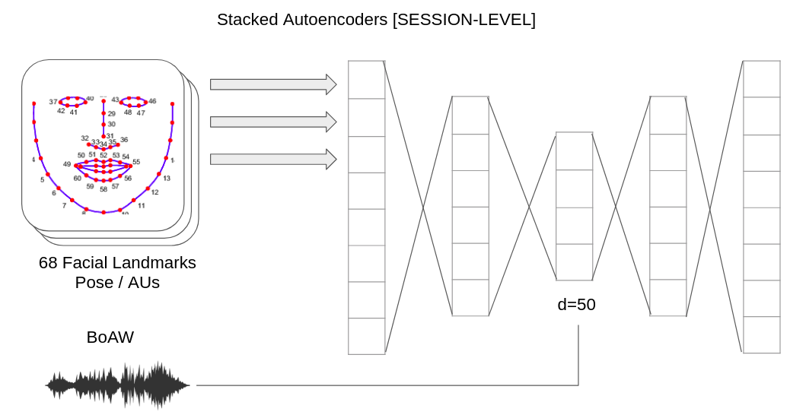
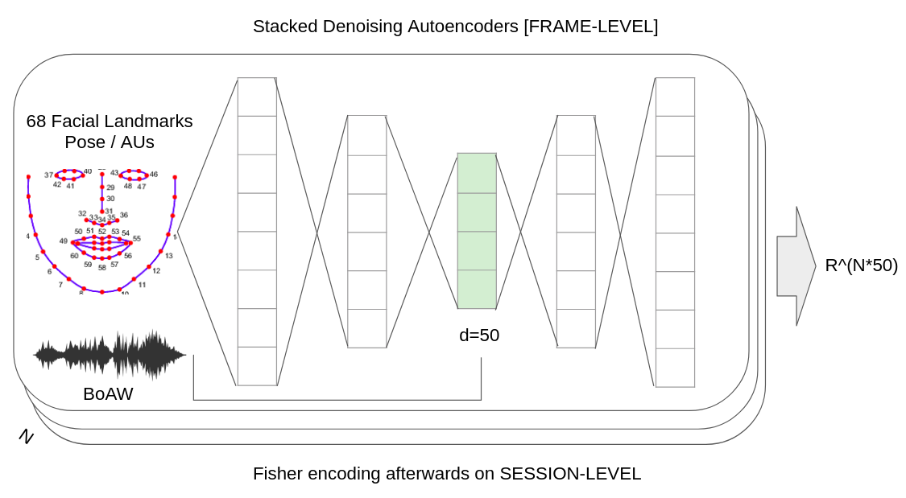

# Performance Comparison

All results in this page, unless indicated, are based on UAR.

## single modality

### audio 

### video

### text (with Turkish corpus)

doc2vec embeddings 

| model name        | UAR (train / dev)| Acc (train / dev) | 
| --                | --        | --      |
| dm_d100_n5_mc2    |  |   |
| dbow_d100_n5_mc2  |  |   | 

MOST SIMILAR WORDS (iyi / good)

| model | 1 | 2 | 3 | 4 | 5 | 6 | 7 | 8 |
| --    | - | - | - | - | - | - | - | - |
| dm    | başarılı | azından | ıyi | kötü | az | pahalıdan | gelişmişe | sağlıklısı | basitinden | 
|       | successful | least | good | bad | little | from expensive | advanced to | healthiest | from simple | 
| dbow  | kuyucu | özneden | iğneliyici | oynasaydı | hồng | kavrayışında | kümesinin | kirpiklerden |
|       | kuyucu | the subject | the iğneliyic | NA | NA | in understanding | set of | the lash |

> 9th May test performance (without involvement of Turkish corpus)

## multiple modality

Autoencoder (session-level) {trained on all available data}

* accuracy on training set: 0.744
* accuracy on development set: 0.381

Autoencoder (frame-level) {trained on all available data}

* accuracy on training set: 0.763
* accuracy on development set: 0.402

## BASELINE (self-implemented)

| UAR (F\*/S\*) | MFCC        | eGeMAPS     | DeepSpectrum | BoAW        | FAU       | BoVW        |
| --            | --          | --          | --           | --          | --        | --          |
| SVM train     | NA          | 0.45 / 0.29 | NA           | NA          | NA / 0.96 | NA          |
| SVM dev       | NA          | 0.35 / 0.33 | NA           | NA          | NA / 0.40 | NA          |
| RF train      | 0.49 / 0.37 | 0.89 / 0.45 | NA           | 0.53 / 0.43 | NA / 0.77 | 0.52 / 0.43 |
| RF dev        | 0.34 / 0.33 | 0.35 / 0.32 | NA           | 0.35 / 0.35 | NA / 0.49 | 0.35 / 0.38 |

> F represents frame-level and S represents session-level (FAUs are extracted on session-level)

## BASELINE (AVEC2018)

| Partition | MFCCs | eGeMAPS | BoAW | Deep | FAUs | BoVW | eGeMAPS + FAUs | Deep + FAUs | 
| --        | --    | --      | --   | --   | --   | --   | --             | --          |
| Dev       | 0.495 | 0.550   | 0.550| 0.582| 0.558| 0.558| 0.603          | **0.635**   |
| Test      | NA    | 0.500   | NA   | 0.444| 0.463| NA   | **0.574**      | 0.444       |

> Unweighted Average Recall (%UAR) of the three classes of BD (remission, hypo-mania, and mania) is used as scoring metric

## Challenge results

| Paper     | Features          | UAR (dev / test)      | Acc (dev / test) | 
| --        | --                | --                    | --               |
| Yang2018  | decision fusion   | 0.783 / 0.407         | 0.783 / NA       |
| Yang2018  | model fusion      | 0.714 / **0.574**     | 0.717 / NA       |
| Du2018    | IncepLSTM {32,64} | 0.651 / NA            | 0.650 / NA       |
| Xing2018  | Hierarchical      | **0.868** / **0.574** | NA / NA          |
| Syed2018  | V                 | NA / **0.574**        | NA / NA          |
| Syed2018  | A+V               | NA / 0.518            | NA / NA          |